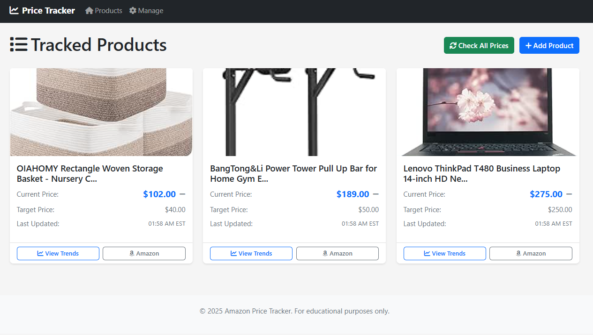
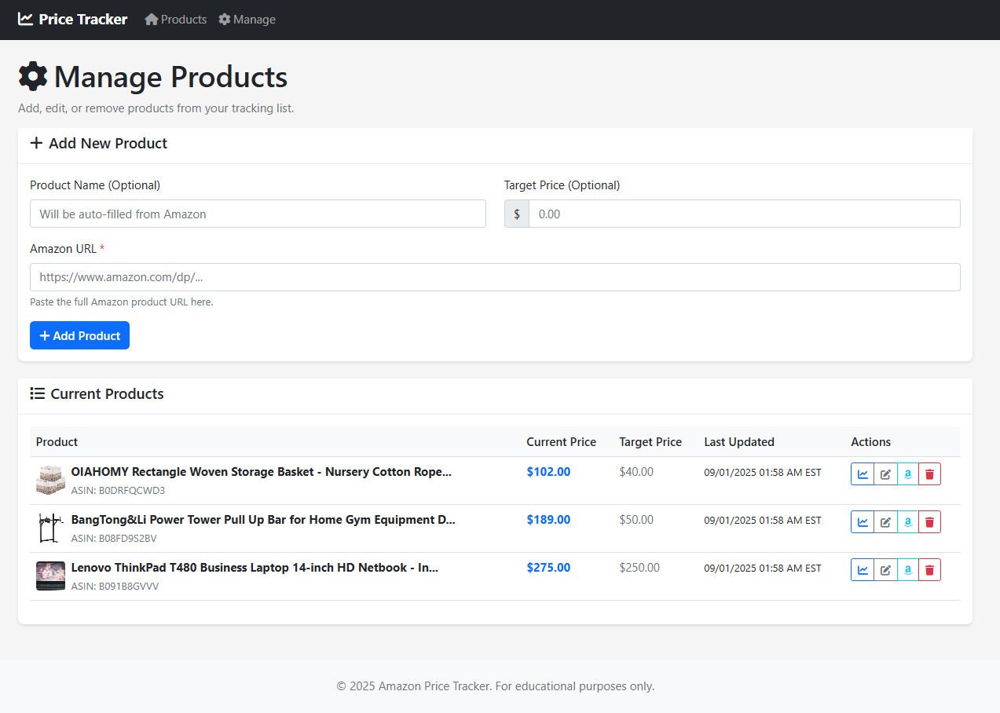
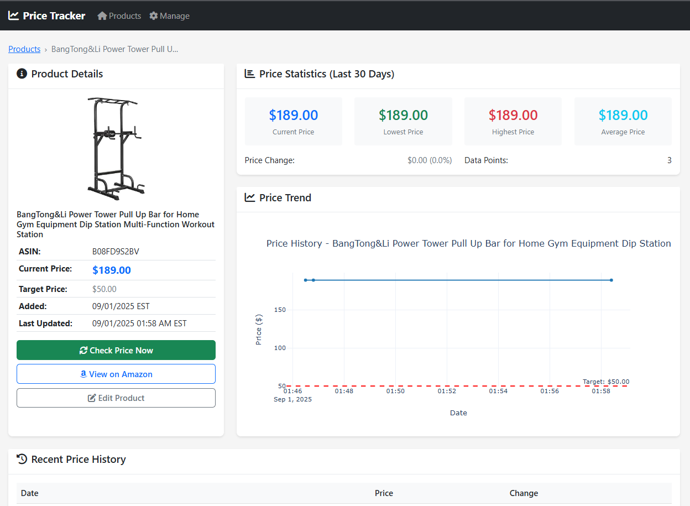
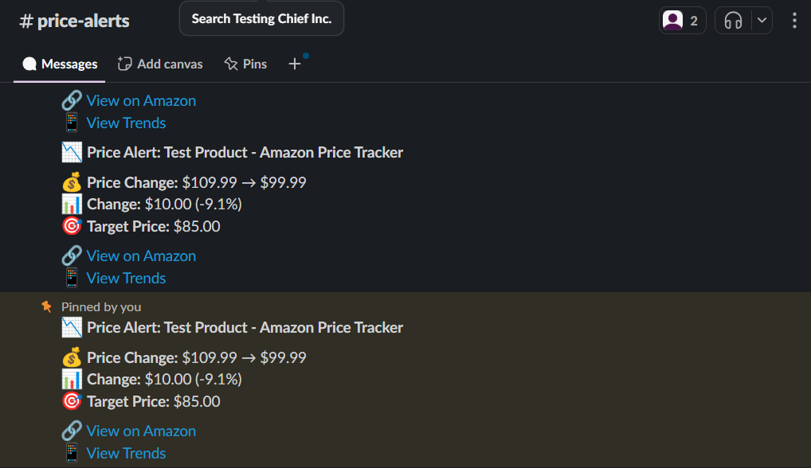

# Amazon Price Tracker

A Python-based web application for tracking Amazon product prices with notifications and trend analysis.

## Screenshots

### Homepage - Product List with Price Trends

*View all tracked products with real-time price trends and one-click bulk price updates*

### Product Management

*Add, edit, and delete tracked products with target price settings*

### Product Details & Price History

*Detailed price trends with interactive charts and historical data*

### Slack Notifications

*Automated Slack alerts for price changes and target price alerts*

## Features

- **Web Interface**: Simple web UI to manage tracked products
- **Price Tracking**: Automated scraping of Amazon product prices
- **Trend Analysis**: Visual charts showing price history and statistics
- **Notifications**: Slack alerts for significant price changes
- **Database**: Local SQLite storage for products and price history
- **Scheduling**: Automated price checks multiple times per day

## Pages

1. **Product List** (`/`): View all tracked products with current prices
2. **Manage Products** (`/manage`): Add, edit, or delete tracked products  
3. **Product Details** (`/product/<id>`): Detailed price trends and statistics

## Setup

### Quick Start (Windows)
1. **Initial Setup**: Double-click `setup_project.bat`
2. **Start Development Server**: Double-click `start_server.bat`
3. **Stop Server**: Double-click `stop_server.bat`
4. **Production Mode**: Double-click `start_production.bat`

### Manual Setup
1. Install dependencies:
   ```bash
   pip install -r requirements.txt
   ```

2. Configure environment variables in `.env`:
   ```
   SLACK_BOT_TOKEN=your-slack-bot-token
   SLACK_CHANNEL=your-slack-channel
   ```

3. Run the application:
   ```bash
   python run_dev.py    # Development mode
   python main.py       # Production mode
   ```

4. Access the web interface at `http://localhost:5000`

> **📸 Note**: Screenshot placeholders are in `static/images/screenshots/`. See the README in that folder for instructions on capturing and adding actual screenshots of your running application.

## Configuration

- Modify `config/settings.py` for scraping intervals and notification thresholds
- Update user agent strings in scraper configuration as needed
- Adjust price change notification sensitivity

## Batch Files (Windows)

- **`setup_project.bat`**: Complete project setup and package installation
- **`start_server.bat`**: Start development server with auto-reload
- **`stop_server.bat`**: Stop all running Python processes
- **`start_production.bat`**: Start production server with background monitoring

## CLI Usage

```bash
python cli.py add "https://amazon.com/dp/B123456789" --target 29.99
python cli.py list
python cli.py check
```

## Note

This tool is for educational purposes. Please respect Amazon's Terms of Service and robots.txt when scraping. Consider using official APIs when available.

## License

This project is licensed under the MIT License - see the [LICENSE](LICENSE) file for details.

## Contributing

1. Fork the repository
2. Create a feature branch (`git checkout -b feature/amazing-feature`)
3. Commit your changes (`git commit -m 'Add some amazing feature'`)
4. Push to the branch (`git push origin feature/amazing-feature`)
5. Open a Pull Request

## Support

If you encounter any issues or have questions, please open an issue on GitHub.
